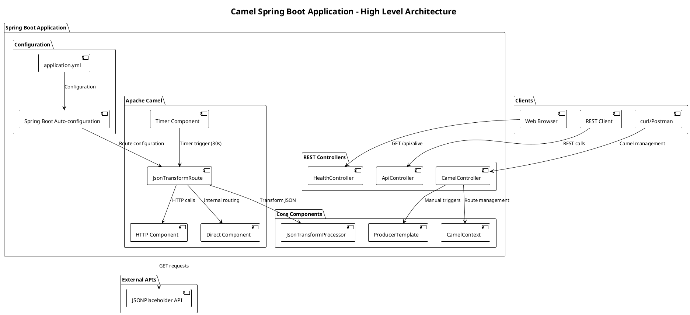
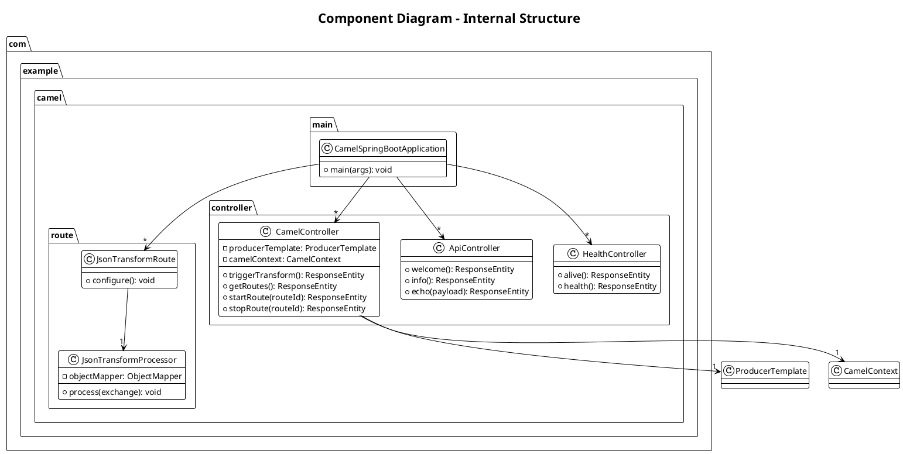
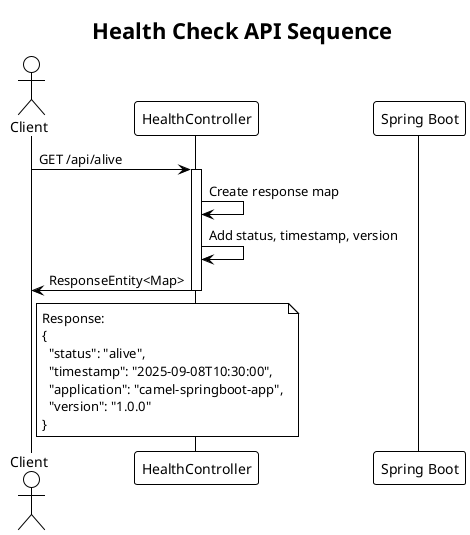
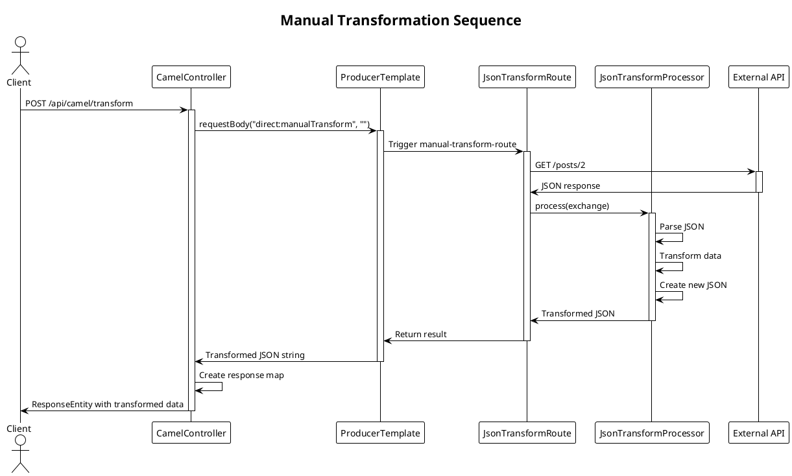
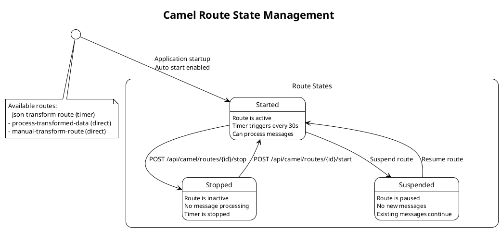
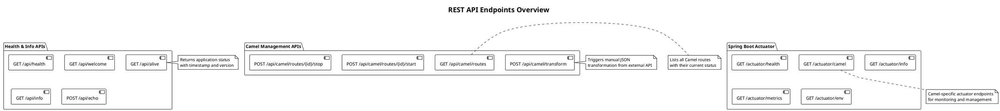

# Camel Spring Boot Application - PlantUML Documentation

This document contains PlantUML diagrams documenting the architecture and flows of the Camel Spring Boot application.

## Table of Contents

1. [Application Architecture](#application-architecture)
2. [Component Diagram](#component-diagram)
3. [Camel Routes Flow](#camel-routes-flow)
4. [REST API Sequence Diagrams](#rest-api-sequence-diagrams)
5. [JSON Transformation Process](#json-transformation-process)
6. [Deployment Diagram](#deployment-diagram)

## Application Architecture



## Component Diagram



## Camel Routes Flow

```plantuml
@startuml Camel_Routes_Flow
!theme plain
title Apache Camel Routes Flow Diagram

start

:Timer (30 seconds);
note right: Automatic trigger every 30 seconds

:Log: Start JSON data retrieval;

:HTTP GET Request;
note right: https://jsonplaceholder.typicode.com/posts/1

:Log: Data retrieved;

:JsonTransformProcessor;
note right
Transform JSON:
- originalId
- transformedTitle (UPPERCASE)
- summary (truncated)
- userId
- transformationTimestamp
- source
end note

:Log: Data transformed;

:Send to direct:processTransformedData;

partition "Process Transformed Data Route" {
    :Log: Processing transformed data;
    
    :Add headers;
    note right
    - ProcessedAt: timestamp
    - DataLength: data size
    end note
    
    :Log: Final data and headers;
}

stop

note bottom
**Manual Transform Route**
Can be triggered via POST /api/camel/transform
Uses the same transformation logic
but fetches from posts/2
end note

@enduml
```

## REST API Sequence Diagrams

### Health Check Flow



### Manual Transformation Flow



## JSON Transformation Process

```plantuml
@startuml JSON_Transformation_Process
!theme plain
title JSON Transformation Process Flow

start

:Receive JSON Input;
note right
Input example:
{
  "id": 1,
  "title": "sample title",
  "body": "sample body content...",
  "userId": 123
}
end note

:Parse JSON with ObjectMapper;

:Extract fields;
split
:Extract id;
split again
:Extract title;
split again
:Extract body;
split again
:Extract userId;
end split

:Create transformed object;
note right
Transformation rules:
- originalId = id
- transformedTitle = "TRANSFORMED: " + title.toUpperCase()
- summary = body.substring(0, 50) + "..."
- userId = userId
- transformationTimestamp = System.currentTimeMillis()
- source = "external-api"
end note

:Convert to JSON string;

:Set as exchange body;

:Add Content-Type header;

stop

note bottom
Output example:
{
  "originalId": 1,
  "transformedTitle": "TRANSFORMED: SAMPLE TITLE",
  "summary": "sample body content...",
  "userId": 123,
  "transformationTimestamp": 1725795600000,
  "source": "external-api"
}
end note

@enduml
```

## Deployment Diagram

```plantuml
@startuml Deployment_Diagram
!theme plain
title Deployment Architecture

node "Development Environment" {
    artifact "camel-springboot-app-1.0.0.jar" as JAR {
        component "Spring Boot 3.2.0" as SB
        component "Apache Camel 4.2.0" as AC
        component "Embedded Tomcat" as ET
    }
    
    database "Configuration Files" as CF {
        file "application.yml"
        file "application-dev.yml"
        file "application-test.yml"
    }
}

cloud "External Services" {
    interface "JSONPlaceholder API" as JPAPI
    note bottom of JPAPI
    https://jsonplaceholder.typicode.com
    - /posts/1 (automatic route)
    - /posts/2 (manual route)
    end note
}

node "Client Applications" {
    artifact "Web Browser" as WB
    artifact "REST Client" as RC
    artifact "curl/Postman" as CP
}

' Connections
JAR --> JPAPI : HTTP GET requests
WB --> JAR : HTTP REST calls
RC --> JAR : HTTP REST calls
CP --> JAR : HTTP REST calls
CF --> JAR : Configuration

' Ports and protocols
JAR : Port 8080-8083 (configurable)
JAR : HTTP/HTTPS
JPAPI : Port 443 (HTTPS)

@enduml
```

## Route States and Management



## API Endpoints Overview



## Usage Instructions

To render these PlantUML diagrams:

1. **Online PlantUML Editor**: Copy and paste each diagram code into [PlantUML Online Editor](http://www.plantuml.com/plantuml/uml/)

2. **VS Code Extension**: Install the "PlantUML" extension and open any `.puml` file

3. **Local PlantUML**: 
   ```bash
   # Install PlantUML
   brew install plantuml  # macOS
   sudo apt-get install plantuml  # Ubuntu
   
   # Generate diagrams
   plantuml documentation.puml
   ```

4. **IntelliJ IDEA**: Install the "PlantUML integration" plugin

## File Organization

Save each diagram in separate `.puml` files:
- `architecture.puml` - Application Architecture
- `components.puml` - Component Diagram  
- `camel-routes.puml` - Camel Routes Flow
- `sequences.puml` - Sequence Diagrams
- `transformation.puml` - JSON Transformation Process
- `deployment.puml` - Deployment Diagram
- `states.puml` - Route State Management
- `api-overview.puml` - API Endpoints Overview
